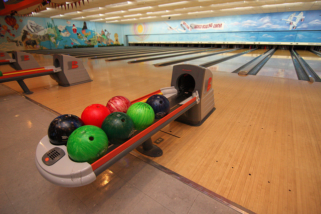

!SLIDE center

*Image by [Sam Howzit](http://www.flickr.com/photos/aloha75/4632129086/)*

!SLIDE center

*Image from [Wikipedia](http://en.wikipedia.org/wiki/File:Python_logo.svg)*

!SLIDE smaller
    score(Rolls) -> frame(1, 0, Rolls).

    frame(11, Score, _BonusRolls) -> Score;

    frame(Frame, Score, [10|Rest]) ->
        [Bonus1, Bonus2|_] = Rest,
        frame(Frame + 1, Score + 10 + Bonus1 + Bonus2, Rest);

    frame(Frame, Score, [First,Second|Rest]) when (First+Second==10)->
        [Bonus1|_] = Rest,
        frame(Frame + 1, Score + 10 + Bonus1, Rest);

    frame(Frame, Score, [First,Second|Rest]) ->
        frame(Frame + 1, Score + First + Second, Rest).

!SLIDE smaller
    test() ->
        test(0,   [0,0, 0,0, 0,0, 0,0, 0,0, 0,0, 0,0, 0,0, 0,0, 0,0]),
        test(20,  [1,1, 1,1, 1,1, 1,1, 1,1, 1,1, 1,1, 1,1, 1,1, 1,1]),
        test(150, [5,5, 5,5, 5,5, 5,5, 5,5, 5,5, 5,5, 5,5, 5,5, 5,5, 5]),
        test(47,  [1,1, 1,1, 1,1, 1,1, 1,1, 1,1, 1,1, 1,1, 1,1, 10, 10 ,9]),
        test(173, [7,3, 7,3, 7,3, 7,3, 7,3, 7,3, 7,3, 7,3, 7,3, 7,3, 10]),

    test(Expected, Rolls) ->
        case score(Rolls) of
            Expected -> io:fwrite("Pass~n");
            Scored -> io:fwrite("Fail: expected=~p, scored=~p~n",
                [Expected, Scored])
        end.

