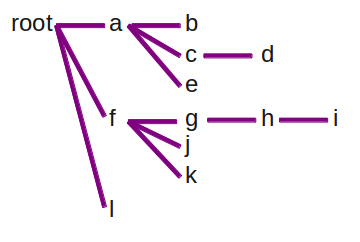
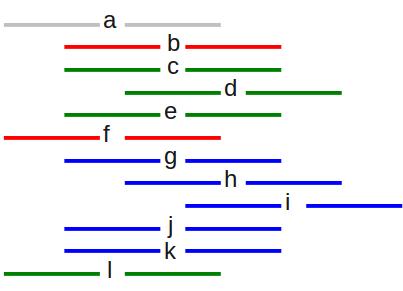
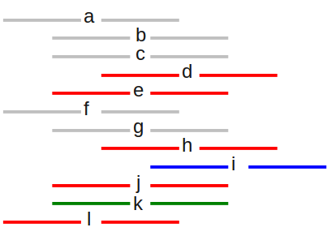

!SLIDE center

*Image by [chrisdlugosz](http://www.flickr.com/photos/chrisdlugosz/2805048271/)*

!SLIDE code
        project
            action
            sub-project
                action
            action
        project
            sub-project
                sub-project
                    action

!SLIDE bullets small
* work on presentation [computer, quiet] (2011-08-24) !!

!SLIDE center

!SLIDE center

!SLIDE center

*Image from [Wikimedia Commons](http://en.wikipedia.org/wiki/File:Ruby_logo.svg)*

!SLIDE center

!SLIDE center

!SLIDE center

!SLIDE center

!SLIDE center

!SLIDE center

*Image from [O'Reilly Media](http://oreilly.com/catalog/9780596006624)*

!SLIDE center

*Image from [IMLS DCC](http://www.flickr.com/photos/imlsdcc/5576592397/)*

!SLIDE small
    @@@ java
        String[] process(String[] input) {
            String[] output = new String[input.length];
            for (int i=0; i < input.length; i++) {
                output[i] = do_stuff(input[i]);
            }
            return output;
        }

!SLIDE
    @@@ erlang
        process([First|Rest], Output) ->
            NewFirst = do_stuff(First),
            process(Rest, [NewFirst|Output]);

!SLIDE
    @@@ erlang
        Output = process(Input, []).

        process([First|Rest], Output) ->
            NewFirst = do_stuff(First),
            process(Rest, [NewFirst|Output]);

        process([], Output) ->
            lists:reverse(Output).

!SLIDE center

*Image by [Brian Hillegas](http://www.flickr.com/photos/seatbelt67/502255276/)*

!SLIDE center

*Image by [Alex E. Proimos](http://www.flickr.com/photos/proimos/4199675334/)*

!SLIDE center

!SLIDE center

!SLIDE center

!SLIDE center

!SLIDE center

!SLIDE
# Erlang: A kinder, gentler Lisp?

!SLIDE smaller
    @@@ erlang
    -record(line, {content, indent}).
    -record(node, {content, children}).

    build_nodes([First|Rest]) ->
        {ChildLines, SiblingLines} =
            split_list(First#line.indent, [], Rest),
        Children = build_nodes(ChildLines),
        Siblings = build_nodes(SiblingLines),
        Node = #node{content=First#line.content, children=Children},
        [Node|Siblings];

    build_nodes([]) -> [].

!SLIDE smaller
    @@@ erlang
    split_list(MinIndent, Children, [First|Rest]) ->
        if 
            First#line.indent > MinIndent ->
                split_list(MinIndent, [First|Children], Rest);
            true ->
                {lists:reverse(Children), [First|Rest]}
        end;

    split_list(_Indent, Children, []) ->
        {lists:reverse(Children), []}.

